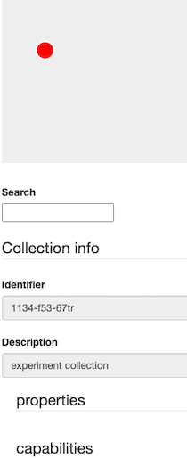

Now, we will try to build up an example of Collection API, which is defined more in details under the following link: https://kit-dm-documentation.readthedocs.io/en/latest/. The example defines a data set of an experiment, which should be published. The set includes raw data, implementation and results. These collections are sub-collections of the “experiment” collection. The „rawData“ collection includes „images“ item. The „implementation“ collection contains two items: „method1“ and „method2“. The „results“ collection includes in turn two subcollections „result1“ and „result2“. The „result1“ collection contains two items: „documents“ and „method1“, which is the same item of the „implementation“ collection. The „result2“ collection contains again two items: „documents“ and „method2“, which is the same item of the „implementation“ collection.

Now, we will build up this example. In order to create a new collection you need to send a POST request to the service. 
All attributes of a collection are optional, but for our example we add some of them
for illustration purposes. We begin by creating the first collection called "experiment" with id "1134-f53-67tr":

`curl --location --request POST 'http://localhost:8080/api/v1/collections/' \
--header 'Content-Type: application/json' \
--data-raw '[
    {
    "id":"1134-f53-67tr",
    "capabilities":{
        "isOrdered": true,
        "appendsToEnd": true,
        "supportsRoles": true,
        "membershipIsMutable": true,
        "propertiesAreMutable": true,
        "maxLength": -1
    },
    "properties":{
        "ownership":"SCC",
        "license": "CC-BY-NC-SA",
        "modelType": "21.T11148/2d1e64bc217fce96a569",
        "hasAccessRestrictions": false
    },
   "description": "experiment collection"
   }
]' |json_pp`{{execute}}

If we now list all collections, we should receive one element containing the 
previously created collection:

`curl http://localhost:8080/api/v1/collections/ |json_pp`{{execute}}

Single collections we can also obtain using the 'id' we defined during the creation process:

`curl http://localhost:8080/api/v1/collections/1134-f53-67tr |json_pp`{{execute}}

If no 'id' was provided, a random UUID is assigned by the service and can be used in the same way.

Now, by opening the link http://localhost:8080/static/overview.html in the browser, you can visualize the created collection and list all its attributes by selecting it as shown below:

---

The remaining collections can be created in the same way. 

Create collection "rawData" with id "2780-a12-hj34":
`curl --location --request POST 'http://localhost:8080/api/v1/collections/' \
--header 'Content-Type: application/json' \
--data-raw '[
    {
    "id":"2780-a12-hj34",
    "capabilities":{
        "isOrdered": false,
        "supportsRoles": true,
        "membershipIsMutable": true,
        "propertiesAreMutable": true,
        "maxLength": -1
    },
    "properties":{
        "ownership":"SCC",
        "license": "CC-BY-NC-SA",
        "modelType": "21.T11148/dc54ae4b6807f5887fda",
        "hasAccessRestrictions": false
    },
   "description": "raw data collection"
   }
]' |json_pp`{{execute}}

Create collection "implementation" with id "4567-a12-gz89":
`curl --location --request POST 'http://localhost:8080/api/v1/collections/' \
--header 'Content-Type: application/json' \
--data-raw '[
    {
    "id":"4567-a12-gz89",
    "capabilities":{
        "isOrdered": false,
        "supportsRoles": true,
        "membershipIsMutable": true,
        "propertiesAreMutable": true,
        "maxLength": -1
    },
    "properties":{
        "ownership":"SCC",
        "license": "CC-BY-NC-SA",
        "modelType": "21.T11148/cs01qp9a2016m4509ypa",
        "hasAccessRestrictions": false
    },
   "description": "implementation collection"
   }
]' |json_pp`{{execute}}

Create collection "results" with id "0846-m51-jd00":
`curl --location --request POST 'http://localhost:8080/api/v1/collections/' \
--header 'Content-Type: application/json' \
--data-raw '[
    {
    "id":"0846-m51-jd00",
    "capabilities":{
        "isOrdered": false,
        "supportsRoles": true,
        "membershipIsMutable": true,
        "propertiesAreMutable": true,
        "maxLength": -1
    },
    "properties":{
        "ownership":"SCC",
        "license": "CC-BY-NC-SA",
        "modelType": "21.T9102/yo23hj10qwll31z72aq77la",
        "hasAccessRestrictions": false
    },
   "description": "results collection"
   }
]' |json_pp`{{execute}}

Create collection "result1" with id "q345-a12-bn45":
`curl --location --request POST 'http://localhost:8080/api/v1/collections/' \
--header 'Content-Type: application/json' \
--data-raw '[
    {
    "id":"q345-a12-bn45",
    "capabilities":{
        "isOrdered": true,
        "appendsToEnd": true,
        "supportsRoles": true,
        "membershipIsMutable": true,
        "propertiesAreMutable": true,
        "maxLength": -1
    },
    "properties":{
        "ownership":"SCC",
        "license": "CC-BY-NC-SA",
        "modelType": "21.T9102/yo23hj10qwll31z72aq77la",
        "hasAccessRestrictions": false
    },
   "description": "result1 collection"
   }
]' |json_pp`{{execute}}

Create collection "result2" with id "y123-b67-l1209"::
`curl --location --request POST 'http://localhost:8080/api/v1/collections/' \
--header 'Content-Type: application/json' \
--data-raw '[
    {
    "id":"y123-b67-l1209",
    "capabilities":{
        "isOrdered": true,
        "appendsToEnd": true,
        "supportsRoles": true,
        "membershipIsMutable": true,
        "propertiesAreMutable": true,
        "maxLength": -1
    },
    "properties":{
        "ownership":"SCC",
        "license": "CC-BY-NC-SA",
        "modelType": "21.T9102/yo23hj10qwll31z72aq77la",
        "hasAccessRestrictions": false
    },
   "description": "result2 collection"
   }
]' |json_pp`{{execute}}

If we now list all collections, we should receive the six created collection:
`curl http://localhost:8080/api/v1/collections/ |json_pp`{{execute}}

Moreover, an overview of the created collections can be visualized as show in the picture below:

