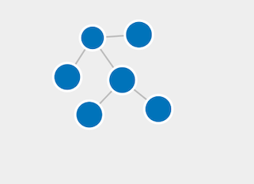

In order to add a relationship between two collections, a POST request should be sent to the service. 
We begin to add the "rawData" as a subcollection to the "experiment" collection. "id", "location" and "datatype" attributes are mandatory fields:
`curl --location --request POST 'http://localhost:8080/api/v1/collections/1134-f53-67tr/members/' \
--header 'Content-Type: application/json' \
--data-raw '[
    {
    "id":"2780-a12-hj34",
    "location": "localhost:8080/api/v1/collections/2780-a12-hj34",
    "datatype": "21.T11148/6a3cacc825e61d9e383f"
    }
]' |json_pp`{{execute}}

If we now list the "experiment" collection with the id "1134-f53-67tr", the "rawData" collection with the id "2780-a12-hj34" should be added to the attribute "members":
`curl http://localhost:8080/api/v1/collections/1134-f53-67tr |json_pp`{{execute}}

If we list the "rawData" collection with the id "2780-a12-hj34", the id "1134-f53-67tr" of the "experiment" collection should be added to the attribute "memberOf" and this means that the "rawData" collection is an item of the "experiment" one.
`curl http://localhost:8080/api/v1/collections/2780-a12-hj34 |json_pp`{{execute}}

Now, we can visualize also the added relationship between both collections, which is represented through an arrow:

Add "implementation" as a subcollection of "experiment" collection:
`curl --location --request POST 'http://localhost:8080/api/v1/collections/1134-f53-67tr/members/' \
--header 'Content-Type: application/json' \
--data-raw '[
    {
    "id":"4567-a12-gz89",
    "location": "localhost:8080/api/v1/collections/4567-a12-gz89",
    "datatype": "21.T520110/gh71kl09cm11ql5a"
    }
]' |json_pp`{{execute}}

Add "results" as a subcollection of "experiment" collection:
`curl --location --request POST 'http://localhost:8080/api/v1/collections/1134-f53-67tr/members/' \
--header 'Content-Type: application/json' \
--data-raw '[
    {
    "id":"0846-m51-jd00",
    "location": "localhost:8080/api/v1/collections/0846-m51-jd00",
    "datatype": "21.T002618/as900lm1qx4ck8"
    }
]' |json_pp`{{execute}}

Now you can obtain all the subcollections included in the "experiment" collection using the following POST request:
`curl http://localhost:8080/api/v1/collections/1134-f53-67tr |json_pp`{{execute}}

An overview of the collections and subcollections is shown below:

"Experiment" collection includes three subcollections: "rawData", "implementation" and "results". Now, we have to add both collections "result1" and "result2" as members to the "results" collection.

Add "result1" as a subcollection of "results" collection:
`curl --location --request POST 'http://localhost:8080/api/v1/collections/0846-m51-jd00/members/' \
--header 'Content-Type: application/json' \
--data-raw '[
    {
    "id":"q345-a12-bn45",
    "location": "localhost:8080/api/v1/collections/q345-a12-bn45",
    "datatype": "21.T002618/as900lm1qx4ck8"
    }
]' |json_pp`{{execute}}

Add "result2" as a subcollection of "results" collection:
`curl --location --request POST 'http://localhost:8080/api/v1/collections/0846-m51-jd00/members/' \
--header 'Content-Type: application/json' \
--data-raw '[
    {
    "id":"y123-b67-l1209",
    "location": "localhost:8080/api/v1/collections/y123-b67-l1209",
    "datatype": "21.T002618/as900lm1qx4ck8"
    }
]' |json_pp`{{execute}}

Now you can obtain all the subcollections included in the "results" collection using the following POST request:
`curl http://localhost:8080/api/v1/collections/0846-m51-jd00 |json_pp`{{execute}}

An overview of all collections and subcollections is shown below:

