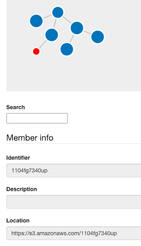
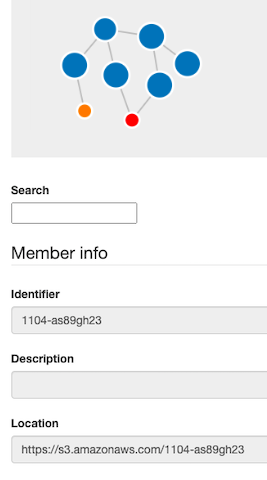
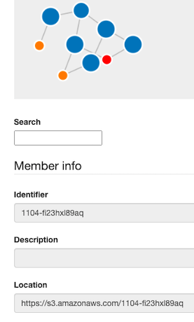
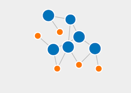

Now we have to create and add member items to the corresponding collections.

Create "images" item and add it to "rawData" collection:
`curl --location --request POST 'http://localhost:8080/api/v1/collections/2780-a12-hj34/members/' \
--header 'Content-Type: application/json' \
--data-raw '[
    {
    "id":"1104fg7340up",
    "location": "https://s3.amazonaws.com/1104fg7340up",
    "datatype": "21.T11148/6a3cacc825e61d9e383f",
    "mappings": {
        "role": "default",
        "index": 0
      }
    }
]' |json_pp`{{execute}}

The item "images" is created and added to "rawData" collection as shown in figure below:

As the item "method1" is a shared member of two collections: "implementation" and "result1". We have to create the item and have only to change the id of the collection in the the POST request.

Create Create "method1" item and add it to "implementation" collection:
`curl --location --request POST 'http://localhost:8080/api/v1/collections/4567-a12-gz89/members/' \
--header 'Content-Type: application/json' \
--data-raw '[
    {
    "id":"1104-as89gh23",
    "location": "https://s3.amazonaws.com/1104-as89gh23",
    "datatype": "21.T520110/gh71kl09cm11ql5a",
    "mappings": {
        "role": "default",
        "index": 0
      }
    }
]' |json_pp`{{execute}}

Create Create "method1" item and add it to "result1" collection:
`curl --location --request POST 'http://localhost:8080/api/v1/collections/q345-a12-bn45/members/' \
--header 'Content-Type: application/json' \
--data-raw '[
    {
    "id":"1104-as89gh23",
    "location": "https://s3.amazonaws.com/1104-as89gh23",
    "datatype": "21.T520110/gh71kl09cm11ql5a",
    "mappings": {
        "role": "default",
        "index": 0
      }
    }
]' |json_pp`{{execute}}

"method1" item is added to both subcollections "implementation" and "result1" as shown below:

Now, we will create the "method2" item and add it in the same way to "implementation" and "result2" collections.

Create "method2" item and add it to "implementation" collection:
`curl --location --request POST 'http://localhost:8080/api/v1/collections/4567-a12-gz89/members/' \
--header 'Content-Type: application/json' \
--data-raw '[
    {
    "id":"1104-fi23hxl89aq",
    "location": "https://s3.amazonaws.com/1104-fi23hxl89aq",
    "datatype": "21.T520110/gh71kl09cm11ql5a",
    "mappings": {
        "index": 1
      }
    }
]' |json_pp`{{execute}}

Create "method2" item and add it to "result2" collection:
`curl --location --request POST 'http://localhost:8080/api/v1/collections/y123-b67-l1209/members/' \
--header 'Content-Type: application/json' \
--data-raw '[
    {
    "id":"1104-fi23hxl89aq",
    "location": "https://s3.amazonaws.com/1104-fi23hxl89aq",
    "datatype": "21.T520110/gh71kl09cm11ql5a",
    "mappings": {
        "index": 1
      }
    }
]' |json_pp`{{execute}}

"method2" item is added to both subcollections "implementation" and "result2" as shown below:

Using the same POSt request, we add the items "documents1" and "documents2" to the corresponding collections.

Create "documents1" item and add it to "result1" collection:
`curl --location --request POST 'http://localhost:8080/api/v1/collections/q345-a12-bn45/members/' \
--header 'Content-Type: application/json' \
--data-raw '[
    {
    "id":"0089-xy45smq4",
    "location": "https://s3.amazonaws.com/0089-xy45smq4",
    "datatype": "21.T002618/as900lm1qx4ck8",
    "mappings": {
        "index": 1
      }
    }
]' |json_pp`{{execute}}

Create "documents2" item and add it to "result2" collection:
`curl --location --request POST 'http://localhost:8080/api/v1/collections/y123-b67-l1209/members/' \
--header 'Content-Type: application/json' \
--data-raw '[
    {
    "id":"1700-gp19aiz38ry",
    "location": "https://s3.amazonaws.com/1700-gp19aiz38ry",
    "datatype": "21.T002618/as900lm1qx4ck8",
    "mappings": {
        "index": 0
      }
    }
]' |json_pp`{{execute}}

Now, a complete overview of the collections and collection items is shown below:

Now you can access to each collection and check if the items were added correctly:
Access collection "rawData":
`curl http://localhost:8080/api/v1/collections/2780-a12-hj34 |json_pp`{{execute}}

Access collection "implementation":
`curl http://localhost:8080/api/v1/collections/4567-a12-gz89 |json_pp`{{execute}}

Access collection "result1":
`curl http://localhost:8080/api/v1/collections/q345-a12-bn45 |json_pp`{{execute}}

Access collection "result2":
`curl http://localhost:8080/api/v1/collections/y123-b67-l1209 |json_pp`{{execute}}
